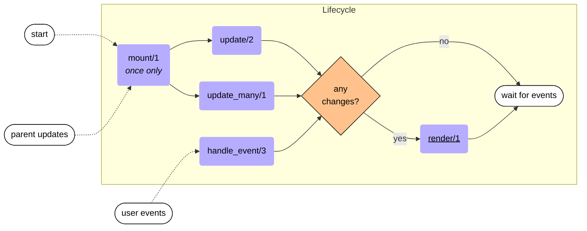

LiveComponents are stateful components that run inside a LiveView process but maintain their own state and lifecycle. They provide a way to compartmentalize state, markup, and events while sharing the LiveView's process.

## When to Use LiveComponents

<Tabs>
  <Tab title="Use LiveComponents When">
    - You need component-level state management
    - The component handles its own events
    - You want to encapsulate complex UI with behavior
    - You need lifecycle callbacks (mount, update)
    - Multiple instances need independent state
  </Tab>
  <Tab title="Use Function Components When">
    - You only need to render UI (no state)
    - The component doesn't handle events
    - You're organizing markup for reuse
    - You want maximum simplicity and performance
  </Tab>
</Tabs>

<Warning>
**General Rule**: Prefer function components over LiveComponents. Only use LiveComponents when you specifically need stateful behavior with event handling. Don't use them just for code organization.
</Warning>

## Basic LiveComponent

### Definition

```elixir
defmodule MyAppWeb.HeroComponent do
  use Phoenix.LiveComponent

  def render(assigns) do
    ~H"""
    <div class="hero">{@content}</div>
    """
  end
end
```

### Rendering

```heex
<.live_component module={MyAppWeb.HeroComponent} id="hero" content={@content} />
```

<Info>
The `id` attribute is **required** and must uniquely identify the component instance. The `module` attribute specifies which LiveComponent to render.
</Info>

## LiveComponent Lifecycle

LiveComponents have a lifecycle similar to LiveViews:

```
First Render:  mount/1 -> update/2 -> render/1
Subsequent:            -> update/2 -> render/1
```

### Lifecycle Diagram



## Lifecycle Callbacks

### mount/1 - Component Initialization

Called **once** when the component is first added to the page.

```elixir
@callback mount(socket :: Socket.t()) ::
  {:ok, Socket.t()} | {:ok, Socket.t(), keyword()}
```

```elixir
def mount(socket) do
  {:ok, assign(socket, :count, 0)}
end
```

<Note>
Unlike LiveView's `mount/3`, LiveComponent's `mount/1` only receives the socket. It does **not** receive params or session.
</Note>

### update/2 - Receive New Assigns

Called whenever the parent LiveView re-renders or when the component receives new assigns.

```elixir
@callback update(assigns :: Socket.assigns(), socket :: Socket.t()) :: 
  {:ok, Socket.t()}
```

```elixir
def update(assigns, socket) do
  {:ok,
   socket
   |> assign(assigns)
   |> load_user()}
end

defp load_user(%{assigns: %{user_id: user_id}} = socket) do
  assign(socket, :user, Accounts.get_user!(user_id))
end
```

<Accordion title="When is update/2 called?">
- After `mount/1` on first render
- Whenever the parent LiveView re-renders
- When the component receives new assigns via `send_update/3`
- Before each `render/1` call
</Accordion>

<Warning>
If you don't define `update/2`, all assigns from `live_component/1` are automatically merged into the socket.
</Warning>

### update_many/1 - Batch Updates

Optional callback that receives all components of the same module being updated, enabling efficient batch operations.

```elixir
@callback update_many([{Socket.assigns(), Socket.t()}]) :: [Socket.t()]
```

#### Solving the N+1 Problem

<Tabs>
  <Tab title="Without update_many (N+1)">
    ```elixir
    def update(assigns, socket) do
      user = Repo.get!(User, assigns.id)
      {:ok, assign(socket, :user, user)}
    end
    ```
    
    If you render 100 user components, this executes 100 database queries!
  </Tab>
  <Tab title="With update_many">
    ```elixir
    def update_many(assigns_sockets) do
      list_of_ids = 
        Enum.map(assigns_sockets, fn {assigns, _socket} -> 
          assigns.id 
        end)

      users =
        from(u in User, where: u.id in ^list_of_ids, select: {u.id, u})
        |> Repo.all()
        |> Map.new()

      Enum.map(assigns_sockets, fn {assigns, socket} ->
        assign(socket, :user, users[assigns.id])
      end)
    end
    ```
    
    This executes just **one** query for all 100 components!
  </Tab>
</Tabs>

<Info>
If `update_many/1` is defined, `update/2` is **not** invoked.
</Info>

### render/1 - Display the Component

```elixir
@callback render(assigns :: Socket.assigns()) :: 
  Phoenix.LiveView.Rendered.t()
```

```elixir
def render(assigns) do
  ~H"""
  <div id={"user-#{@id}"} class="user">
    <h3>{@user.name}</h3>
    <p>{@user.email}</p>
  </div>
  """
end
```

### handle_event/3 - Component Events

```elixir
@callback handle_event(
  event :: binary,
  unsigned_params :: Phoenix.LiveView.unsigned_params(),
  socket :: Socket.t()
) :: {:noreply, Socket.t()} | {:reply, map, Socket.t()}
```

```elixir
def handle_event("increment", _params, socket) do
  {:noreply, update(socket, :count, &(&1 + 1))}
end
```

<Warning>
For events to reach a LiveComponent, the element **must** have a `phx-target` attribute.
</Warning>

## Event Targeting

### Targeting the Component Itself

Use `@myself` to send events to the current component:

```heex
<button phx-click="increment" phx-target={@myself}>
  Count: {@count}
</button>
```

### Targeting by ID

```heex
<!-- Target component with DOM ID "user-13" -->
<button phx-click="refresh" phx-target="#user-13">
  Refresh User
</button>
```

### Targeting by Class

```heex
<!-- Target all components with class "user-card" -->
<button phx-click="close" phx-target=".user-card">
  Close All
</button>
```

### Targeting Multiple Components

```heex
<button phx-click="close" phx-target="#modal, #sidebar">
  Dismiss
</button>
```

## State Management Patterns

### LiveView as Source of Truth

The parent LiveView owns the data and passes it to components.

```heex
<!-- Parent LiveView -->
<.live_component
  :for={card <- @cards}
  module={CardComponent}
  card={card}
  id={card.id}
/>
```

```elixir
# CardComponent
def handle_event("update_title", %{"title" => title}, socket) do
  # Don't update local state - notify parent instead
  send(self(), {:updated_card, %{socket.assigns.card | title: title}})
  {:noreply, socket}
end
```

```elixir
# Parent LiveView
def handle_info({:updated_card, card}, socket) do
  cards = Enum.map(socket.assigns.cards, fn c ->
    if c.id == card.id, do: card, else: c
  end)
  {:noreply, assign(socket, :cards, cards)}
end
```

### LiveComponent as Source of Truth

The component manages its own data independently.

```heex
<!-- Parent only passes ID -->
<.live_component
  :for={card_id <- @card_ids}
  module={CardComponent}
  id={card_id}
/>
```

```elixir
# CardComponent loads and manages its own data
def update_many(assigns_sockets) do
  ids = Enum.map(assigns_sockets, fn {assigns, _} -> assigns.id end)
  
  cards =
    from(c in Card, where: c.id in ^ids, select: {c.id, c})
    |> Repo.all()
    |> Map.new()
  
  Enum.map(assigns_sockets, fn {assigns, socket} ->
    assign(socket, :card, cards[assigns.id])
  end)
end

def handle_event("update_title", %{"title" => title}, socket) do
  card = %{socket.assigns.card | title: title}
  Cards.update_card(card)
  {:noreply, assign(socket, :card, card)}
end
```

<Note>
Components don't have `handle_info/2`. To receive PubSub messages, the parent LiveView must receive them and forward via `send_update/3`.
</Note>

## Communicating Between Components

### Using Callbacks (Recommended)

Pass callback functions as assigns:

```heex
<.live_component
  module={CardComponent}
  id={@card.id}
  card={@card}
  on_update={fn card -> send(self(), {:updated_card, card}) end}
/>
```

```elixir
def handle_event("save", params, socket) do
  socket.assigns.on_update.(updated_card)
  {:noreply, socket}
end
```

### Using send_update/3

Update a component programmatically from anywhere:

```elixir
# From LiveView
def handle_info({:refresh_card, card_id}, socket) do
  send_update(CardComponent, id: card_id, refresh: true)
  {:noreply, socket}
end

# From another component
def handle_event("refresh_all", _params, socket) do
  send_update(CardComponent, id: "card-1", refresh: true)
  {:noreply, socket}
end
```

<Accordion title="send_update/3 Details">
- Sends a message to update a specific component
- Triggers the component's `update/2` or `update_many/1` callback
- Can target components by module + id or by `@myself`
- Useful for updating components from outside their render tree
</Accordion>

## Slots in LiveComponents

LiveComponents support slots just like function components:

```elixir
slot :inner_block, required: true

def render(assigns) do
  ~H"""
  <div class="wrapper">
    {render_slot(@inner_block)}
  </div>
  """
end
```

Usage:

```heex
<.live_component module={MyComponent} id="wrapper">
  <p>Inner content here</p>
</.live_component>
```

<Warning>
If you define `update/2`, ensure it preserves the `:inner_block` assign:

```elixir
def update(assigns, socket) do
  {:ok, assign(socket, assigns)}
end
```
</Warning>

## Async Operations

LiveComponents can use `handle_async/3` for async work:

```elixir
def update(assigns, socket) do
  socket =
    socket
    |> assign(assigns)
    |> assign_async(:data, fn ->
      {:ok, %{data: fetch_data(assigns.id)}}
    end)
  
  {:ok, socket}
end

def handle_async(:data, {:ok, %{data: data}}, socket) do
  {:noreply, assign(socket, :data, data)}
end

def handle_async(:data, {:exit, reason}, socket) do
  {:noreply, put_flash(socket, :error, "Failed to load data")}
end
```

## Live Navigation

Components can use `push_patch/2` and `push_navigate/2`:

```heex
<.link patch={~p"/items/#{@item.id}"}>View Item</.link>
```

<Note>
Live patches are always handled by the parent LiveView's `handle_params/3`, not the component.
</Note>

## Performance Considerations

### Memory Usage

LiveComponents keep all assigns in memory (just like LiveViews). Be mindful:

```heex
<!-- BAD - passes all parent assigns -->
<.live_component module={MyComponent} {assigns} />

<!-- GOOD - only pass what's needed -->
<.live_component module={MyComponent} user={@user} id={@user.id} />
```

### Change Tracking

LiveView tracks changes efficiently, but only at the component boundary:

```elixir
# If only @user.name changes, only that component re-renders
<.live_component module={UserCard} id={user.id} name={user.name} />
```

### Optimization Tips

<Accordion title="Use update_many/1 for batch operations">
  Prevents N+1 queries when rendering multiple instances.
</Accordion>

<Accordion title="Keep assigns minimal">
  Only store what the component actually needs.
</Accordion>

<Accordion title="Prefer function components when possible">
  They're simpler and have less overhead.
</Accordion>

## Common Patterns

### Modal Component

```elixir
defmodule MyAppWeb.ModalComponent do
  use Phoenix.LiveComponent

  attr :title, :string, required: true
  attr :on_close, :any, required: true
  slot :inner_block, required: true

  def render(assigns) do
    ~H"""
    <div class="modal" phx-click-away={@on_close}>
      <div class="modal-content">
        <div class="modal-header">
          <h2>{@title}</h2>
          <button phx-click="close" phx-target={@myself}>×</button>
        </div>
        <div class="modal-body">
          {render_slot(@inner_block)}
        </div>
      </div>
    </div>
    """
  end

  def handle_event("close", _params, socket) do
    socket.assigns.on_close.()
    {:noreply, socket}
  end
end
```

### Form Component

```elixir
defmodule MyAppWeb.UserFormComponent do
  use Phoenix.LiveComponent

  def mount(socket) do
    {:ok, socket}
  end

  def update(assigns, socket) do
    changeset = Accounts.change_user(assigns.user)
    {:ok, assign(socket, assigns) |> assign(:form, to_form(changeset))}
  end

  def render(assigns) do
    ~H"""
    <.form for={@form} phx-submit="save" phx-target={@myself}>
      <.input field={@form[:name]} label="Name" />
      <.input field={@form[:email]} label="Email" />
      <.button>Save</.button>
    </.form>
    """
  end

  def handle_event("save", %{"user" => user_params}, socket) do
    case Accounts.update_user(socket.assigns.user, user_params) do
      {:ok, user} ->
        send(self(), {:user_updated, user})
        {:noreply, socket}
      {:error, changeset} ->
        {:noreply, assign(socket, :form, to_form(changeset))}
    end
  end
end
```

### Infinite Scroll Component

```elixir
defmodule MyAppWeb.InfiniteScrollComponent do
  use Phoenix.LiveComponent

  def update(assigns, socket) do
    {:ok,
     socket
     |> assign(assigns)
     |> assign_new(:page, fn -> 1 end)
     |> load_items()}
  end

  def render(assigns) do
    ~H"""
    <div id="items" phx-hook="InfiniteScroll" phx-target={@myself}>
      <div :for={item <- @items} class="item">
        {item.title}
      </div>
      <div phx-click="load-more" phx-target={@myself}>Load More</div>
    </div>
    """
  end

  def handle_event("load-more", _params, socket) do
    {:noreply, socket |> update(:page, &(&1 + 1)) |> load_items()}
  end

  defp load_items(socket) do
    items = Content.list_items(page: socket.assigns.page)
    update(socket, :items, &(&1 ++ items))
  end
end
```

## Testing LiveComponents

```elixir
import Phoenix.LiveViewTest

test "renders component" do
  html = render_component(&MyComponent.render/1, id: "test", user: %User{})
  assert html =~ "Hello"
end

test "handles events" do
  {:ok, view, _html} = live(conn, "/page")
  
  html = 
    view
    |> element("#my-component button")
    |> render_click()
  
  assert html =~ "Updated"
end
```

## Summary

- LiveComponents maintain their own state within the parent LiveView's process
- Always pass unique `id` and `module` attributes
- Lifecycle: `mount/1` → `update/2` → `render/1` → `handle_event/3`
- Use `update_many/1` to prevent N+1 queries
- Events require `phx-target={@myself}` to reach the component
- Use `send_update/3` to update components programmatically
- Prefer function components unless you need stateful behavior
- Keep component assigns minimal for better performance
- Use callbacks for parent-child communication
