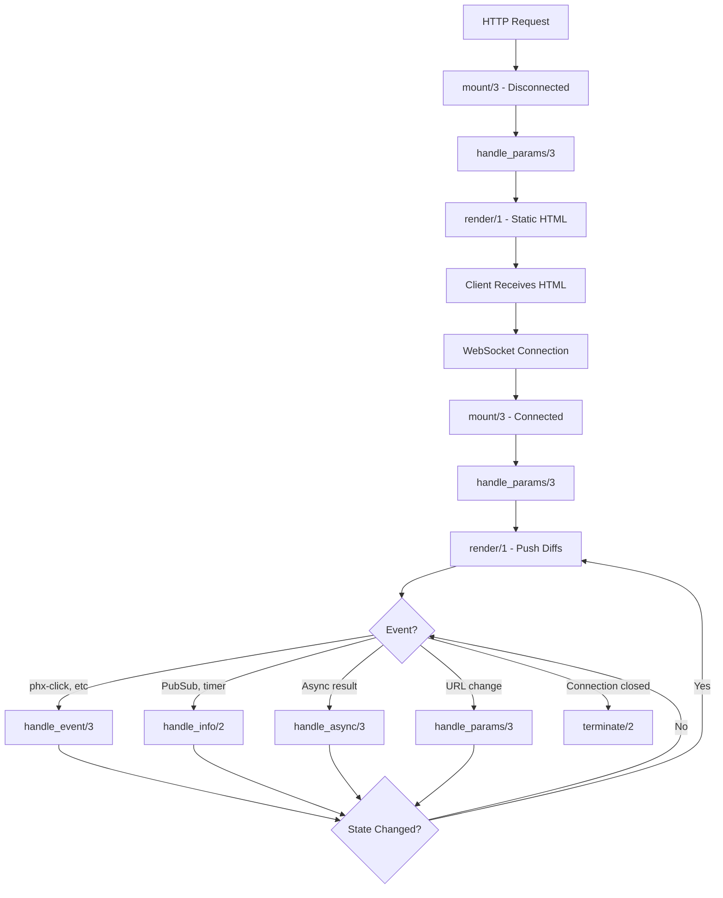

A LiveView is a process that receives events, updates its state, and renders updates to a page as diffs. Understanding the lifecycle is essential for building robust real-time applications.

## Overview

A LiveView begins as a regular HTTP request and HTML response, then upgrades to a stateful view on client connect. This two-phase lifecycle guarantees a regular HTML page even if JavaScript is disabled.

<Steps>
  <Step title="Initial HTTP Request">
    The LiveView is rendered statically as part of a normal HTTP response
  </Step>
  <Step title="WebSocket Connection">
    The client establishes a WebSocket connection to the server
  </Step>
  <Step title="Stateful Process">
    A LiveView process is spawned and mounted on the server
  </Step>
  <Step title="Event Handling">
    The process handles events and pushes diffs to the client
  </Step>
</Steps>

## The Two-Phase Lifecycle

### Disconnected Render (Static)

When a user first accesses a LiveView, it's rendered in its **disconnected state** as part of a regular HTML response.

```elixir
def mount(_params, _session, socket) do
  # This runs during BOTH disconnected and connected mounts
  if connected?(socket) do
    # Only runs when WebSocket is connected
    :timer.send_interval(1000, self(), :tick)
  end
  
  {:ok, assign(socket, :date, :calendar.local_time())}
end
```

<Info>
Use `connected?/1` to detect whether the mount is happening during the initial HTTP request (disconnected) or after the WebSocket connection (connected).
</Info>

### Connected Render (Stateful)

After the static page is rendered, the JavaScript client connects via WebSocket:

1. A new LiveView process is spawned on the server
2. `mount/3` is called again (this time with `connected?(socket) == true`)
3. `handle_params/3` is invoked
4. `render/1` is called and diffs are pushed to the client

## Core Lifecycle Callbacks

### mount/3 - The Entry Point

The `mount/3` callback is invoked when the LiveView starts. It's called **twice** for each LiveView: once during disconnected render and once when the WebSocket connects.

```elixir
@callback mount(
  params :: unsigned_params() | :not_mounted_at_router,
  session :: map,
  socket :: Socket.t()
) :: {:ok, Socket.t()} | {:ok, Socket.t(), keyword()}
```

#### Parameters

- **params** - A map of string keys containing public data (query params and router path params)
- **session** - Private data set by the application (e.g., user authentication)
- **socket** - The LiveView socket

#### Return Values

```elixir
# Simple return
{:ok, socket}

# With options
{:ok, socket, temporary_assigns: [:posts], layout: {MyAppWeb.Layouts, :app}}
```

<Tabs>
  <Tab title="Basic Example">
    ```elixir
    def mount(_params, _session, socket) do
      {:ok, assign(socket, :count, 0)}
    end
    ```
  </Tab>
  <Tab title="With Parameters">
    ```elixir
    def mount(%{"id" => id}, _session, socket) do
      user = Accounts.get_user!(id)
      {:ok, assign(socket, :user, user)}
    end
    ```
  </Tab>
  <Tab title="With Session">
    ```elixir
    def mount(_params, %{"user_id" => user_id}, socket) do
      user = Accounts.get_user!(user_id)
      {:ok, assign(socket, :current_user, user)}
    end
    ```
  </Tab>
  <Tab title="Connected-Only Logic">
    ```elixir
    def mount(_params, _session, socket) do
      if connected?(socket) do
        Phoenix.PubSub.subscribe(MyApp.PubSub, "updates")
      end
      
      {:ok, assign(socket, :messages, [])}
    end
    ```
  </Tab>
</Tabs>

### handle_params/3 - URL and Navigation

The `handle_params/3` callback is invoked **after mount** and whenever there is a live navigation event (like `push_patch/2` or `<.link patch={...}>`). This is only available for LiveViews mounted at the router.

```elixir
@callback handle_params(
  unsigned_params(),
  uri :: String.t(),
  socket :: Socket.t()
) :: {:noreply, Socket.t()}
```

<Warning>
`handle_params/3` is **only** allowed on LiveViews mounted at the router. Child LiveViews rendered with `live_render/3` cannot use this callback.
</Warning>

#### Example: Handling Tabs

```elixir
def handle_params(%{"tab" => tab}, _uri, socket) do
  {:noreply, assign(socket, :active_tab, tab)}
end

def handle_params(_params, _uri, socket) do
  {:noreply, assign(socket, :active_tab, "home")}
end
```

#### Example: Loading Data Based on URL

```elixir
def handle_params(%{"id" => id}, _uri, socket) do
  post = Blog.get_post!(id)
  {:noreply, assign(socket, :post, post)}
end
```

### render/1 - Template Rendering

The `render/1` callback is invoked whenever LiveView detects new content must be rendered and sent to the client.

```elixir
@callback render(assigns :: Socket.assigns()) :: Phoenix.LiveView.Rendered.t()
```

<Tabs>
  <Tab title="Inline Template">
    ```elixir
    def render(assigns) do
      ~H"""
      <div>
        <h1>{@title}</h1>
        <p>Count: {@count}</p>
      </div>
      """
    end
    ```
  </Tab>
  <Tab title="External Template">
    If you don't define `render/1`, LiveView will look for a template file:
    
    ```
    lib/my_app_web/live/user_live.ex
    lib/my_app_web/live/user_live.html.heex
    ```
  </Tab>
</Tabs>

### handle_event/3 - Client Events

The `handle_event/3` callback handles events sent by the client (via `phx-click`, `phx-submit`, etc.).

```elixir
@callback handle_event(
  event :: binary,
  unsigned_params(),
  socket :: Socket.t()
) :: {:noreply, Socket.t()} | {:reply, map, Socket.t()}
```

#### Examples

```elixir
# Simple event with no reply
def handle_event("increment", _params, socket) do
  {:noreply, update(socket, :count, &(&1 + 1))}
end

# Event with parameters
def handle_event("delete", %{"id" => id}, socket) do
  Posts.delete_post(id)
  {:noreply, socket}
end

# Event with reply to client
def handle_event("validate", %{"user" => user_params}, socket) do
  changeset = Accounts.change_user(%User{}, user_params)
  {:reply, %{valid: changeset.valid?}, assign(socket, :changeset, changeset)}
end
```

## Process Communication Callbacks

### handle_info/2 - Elixir Messages

Handles messages from other Elixir processes (PubSub, GenServer messages, timers, etc.).

```elixir
@callback handle_info(msg :: term, socket :: Socket.t()) ::
  {:noreply, Socket.t()}
```

#### Example: PubSub Subscription

```elixir
def mount(_params, _session, socket) do
  if connected?(socket) do
    Phoenix.PubSub.subscribe(MyApp.PubSub, "posts")
  end
  
  {:ok, assign(socket, :posts, list_posts())}
end

def handle_info({:post_created, post}, socket) do
  {:noreply, update(socket, :posts, fn posts -> [post | posts] end)}
end

def handle_info(:tick, socket) do
  {:noreply, assign(socket, :time, DateTime.utc_now())}
end
```

### handle_call/3 and handle_cast/2

LiveView processes can also handle `GenServer` calls and casts:

```elixir
@callback handle_call(msg :: term, {pid, reference}, socket :: Socket.t()) ::
  {:noreply, Socket.t()} | {:reply, term, Socket.t()}

@callback handle_cast(msg :: term, socket :: Socket.t()) ::
  {:noreply, Socket.t()}
```

## Async Operations

### handle_async/3 - Async Task Results

Handles results from async operations started with `start_async/3` or `assign_async/3`.

```elixir
@callback handle_async(
  name :: term,
  async_fun_result :: {:ok, term} | {:exit, term},
  socket :: Socket.t()
) :: {:noreply, Socket.t()}
```

#### Example: Loading Data Asynchronously

```elixir
def mount(%{"slug" => slug}, _session, socket) do
  {:ok,
   socket
   |> assign(:foo, "bar")
   |> assign_async(:org, fn -> 
     {:ok, %{org: fetch_org!(slug)}} 
   end)}
end

def handle_async(:org, {:ok, %{org: org}}, socket) do
  {:noreply, assign(socket, :org, org)}
end

def handle_async(:org, {:exit, reason}, socket) do
  {:noreply, put_flash(socket, :error, "Failed to load organization")}
end
```

<Warning>
**Anti-pattern**: Don't pass the socket to async functions as it copies the entire struct.

```elixir
# BAD - copies entire socket
assign_async(:org, fn -> {:ok, %{org: fetch_org(socket.assigns.slug)}} end)

# GOOD - only copy what you need
slug = socket.assigns.slug
assign_async(:org, fn -> {:ok, %{org: fetch_org(slug)}} end)
```
</Warning>

## Termination

### terminate/2 - Cleanup

The `terminate/2` callback is invoked when the LiveView is terminating.

```elixir
@callback terminate(reason, socket :: Socket.t()) :: term
  when reason: :normal | :shutdown | {:shutdown, :left | :closed | term}
```

<Note>
This callback is only invoked if the LiveView is trapping exits. For most LiveViews, cleanup happens automatically when the process terminates.
</Note>

## Complete Lifecycle Flow



## Lifecycle Hooks

You can attach hooks to specific lifecycle stages using `attach_hook/4`:

```elixir
def mount(_params, _session, socket) do
  socket = 
    attach_hook(socket, :my_hook, :handle_event, fn
      "save", params, socket ->
        # Custom logic before handle_event
        {:cont, socket}
    end)
  
  {:ok, socket}
end
```

## on_mount Hooks

Define reusable mount logic that runs before your LiveView's mount callback:

```elixir
defmodule MyAppWeb.UserAuth do
  import Phoenix.LiveView
  
  def on_mount(:require_authenticated, _params, session, socket) do
    case session do
      %{"user_id" => user_id} ->
        {:cont, assign(socket, :current_user, get_user!(user_id))}
      _ ->
        {:halt, redirect(socket, to: "/login")}
    end
  end
end
```

Then use it in your router:

```elixir
live_session :authenticated, on_mount: {MyAppWeb.UserAuth, :require_authenticated} do
  live "/dashboard", DashboardLive
end
```

## Best Practices

<Accordion title="Minimize work in mount/3">
  Only load essential data during mount. Use `assign_async/3` for expensive operations.
</Accordion>

<Accordion title="Use connected? for stateful operations">
  Subscribe to PubSub, start timers, and open connections only when `connected?(socket)` returns true.
</Accordion>

<Accordion title="Keep assigns minimal">
  Only store what you need in assigns. Large data structures are kept in memory and tracked for changes.
</Accordion>

<Accordion title="Prefer handle_params for URL state">
  Use `handle_params/3` instead of `handle_event/3` for operations that should update the URL.
</Accordion>

## Common Patterns

### Loading State Pattern

```elixir
def mount(_params, _session, socket) do
  {:ok, assign(socket, loading: true, data: nil)}
end

def handle_params(%{"id" => id}, _uri, socket) do
  if connected?(socket) do
    send(self(), {:load_data, id})
  end
  {:noreply, socket}
end

def handle_info({:load_data, id}, socket) do
  data = fetch_data(id)
  {:noreply, assign(socket, loading: false, data: data)}
end
```

### Reconnection Handling

```elixir
def mount(_params, _session, socket) do
  if connected?(socket) do
    # Resubscribe on reconnection
    Phoenix.PubSub.subscribe(MyApp.PubSub, "topic")
  end
  
  {:ok, socket}
end
```

## Summary

- **mount/3** is called twice: once disconnected, once connected
- **handle_params/3** runs after mount and on live navigation events
- **render/1** is automatically called after any state change
- **handle_event/3** processes client events
- **handle_info/2** receives messages from other Elixir processes
- **handle_async/3** handles async operation results
- Use **connected?/1** to differentiate between disconnected and connected mounts
